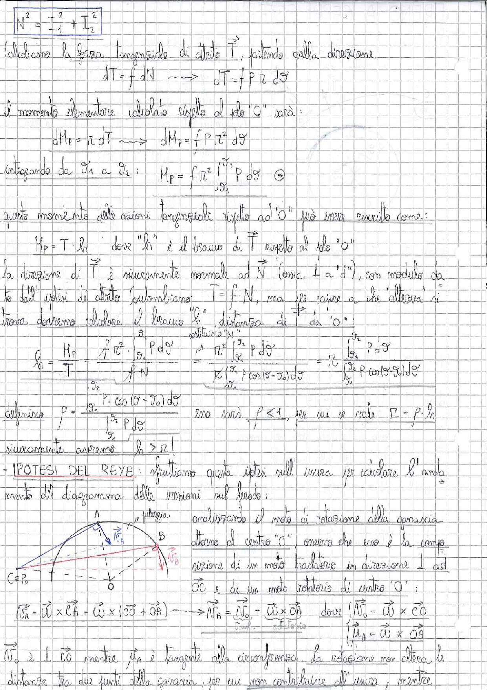

# Page 182 - Attrito nei perni (momento delle azioni tangenziali e ipotesi del Reye)

$$\boxed{N^2 = I_1^2 + I_2^2}$$

Calcoliamo la forza tangenziale di attrito $\vec{T}$, partendo dalla direzione:

$$dT = f \, dN \implies dT = f \, P \, r \, d\vartheta$$

Il momento elementare calcolato rispetto al polo "O" sarà:

$$dM_P = r \, dT \implies dM_P = f \, P \, r^2 \, d\vartheta$$

integrando da $\vartheta_1$ a $\vartheta_2$:

$$\boxed{M_P = f \, r^2 \int_{\vartheta_1}^{\vartheta_2} P \, d\vartheta \quad \circledast}$$

Questo momento delle azioni tangenziali rispetto ad "O" può essere riscritto come:

$$M_P = T \cdot h \quad \text{dove "h" è il braccio di } \vec{T} \text{ rispetto al polo "O"}$$

La direzione di $\vec{T}$ è sicuramente normale ad $\vec{N}$ (ossia $\perp$ a "$d$"), con modulo dato dall'ipotesi di attrito colombiano $T = f \cdot N$, ma per capire a che "altezza" si trova dovremo calcolare il braccio "h", distanza di $\vec{T}$ da "O":

$$h = \frac{M_P}{T} = \frac{f \, r^2 \int_{\vartheta_1}^{\vartheta_2} P \, d\vartheta}{f \, N} = \frac{r^2 \int_{\vartheta_1}^{\vartheta_2} P \, d\vartheta}{r \int_{\vartheta_1}^{\vartheta_2} P \cos(\vartheta - \vartheta_0) \, d\vartheta} = \frac{r^2 \int_{\vartheta_1}^{\vartheta_2} P \, d\vartheta}{\int_{\vartheta_1}^{\vartheta_2} P \cos(\vartheta - \vartheta_0) \, d\vartheta}$$

Definisco:

$$\rho = \frac{\int_{\vartheta_1}^{\vartheta_2} P \cos(\vartheta - \vartheta_0) \, d\vartheta}{\int_{\vartheta_1}^{\vartheta_2} P \, d\vartheta}$$

esso sarà $\rho \leq 1$, per cui se vale $\boxed{r_i = \rho \cdot h}$

sicuramente avremo $\boxed{h > r}$ !

---

## IPOTESI DEL REYE

Sfruttiamo questa ipotesi sull'usura per calcolare l'andamento del diagramma delle pressioni sul perno:

> 
> Diagramma: Schema della ganascia del freno con centro di rotazione "O", punti A e B sulla superficie di contatto, vettori velocità $\vec{V}_A$ e $\vec{V}_B$, e punto C = P₀. Viene mostrato il moto di rotazione della ganascia attorno al centro "C".

Analizzando il moto di rotazione della ganascia attorno al centro "C", osservo che esso è la composizione di un moto traslatorio in direzione $\perp$ ad $\overline{OC}$ e di un moto rotatorio di centro "O":

$$\vec{V}_A = \vec{\omega} \times \vec{CA} = \vec{\omega} \times (\vec{CO} + \vec{OA}) \implies \vec{V}_A = \vec{V}_O + \vec{\omega} \times \vec{OA}$$

dove:

$$\begin{cases} \vec{V}_O = \vec{\omega} \times \vec{CO} \quad \text{(trasl.)} \\ \vec{\mu}_A = \vec{\omega} \times \vec{OA} \quad \text{(rotat.)} \end{cases}$$

$\vec{V}_O$ è $\perp$ CO mentre $\mu_A$ è tangente alla circonferenza. La rotazione non altera le distanze tra due punti della ganascia, per cui non contribuisce all'usura; mentre
