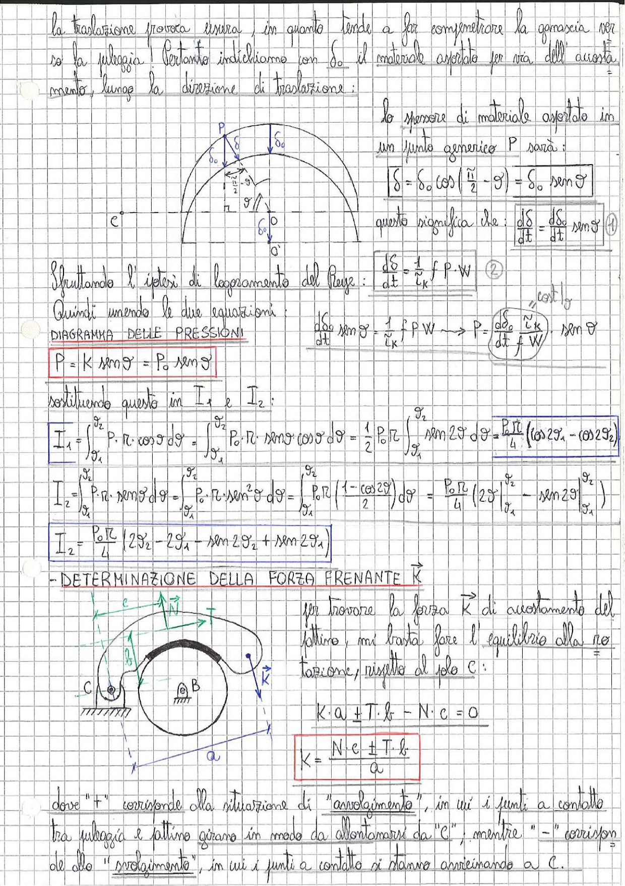

# Page 183 - Usura del freno a ceppo e determinazione della forza frenante

La traslazione provoca usura, in quanto tende a far compenetrare la ganascia verso la puleggia. Pertanto indichiamo con $\delta_0$ il materiale asportato per via dell'accostamento, lungo la direzione di traslazione:

> 
> Diagramma: schema semicircolare della ganascia con indicazione dello spessore di usura $\delta$ in funzione dell'angolo $\vartheta$, pressione $P$ nel punto generico, e spessori $\delta_0$ lungo la direzione di traslazione

Lo spessore di materiale asportato in un punto generico P sarà:

$$\boxed{\delta = \delta_0 \cos\left(\frac{\pi}{2} - \vartheta\right) = \delta_0 \sin\vartheta}$$

Questo significa che:

$$\frac{d\delta}{dt} = \frac{d\delta_0}{dt} \sin\vartheta \quad \text{①}$$

Sfruttando l'ipotesi di logramento del Reye:

$$\frac{d\delta}{dt} = \frac{1}{r_k} f \cdot P \cdot W \quad \text{②}$$

Quindi unendo le due equazioni:

$$\frac{d\delta_0}{dt} \sin\vartheta = \frac{1}{r_k} f \cdot P \cdot W \quad \longrightarrow \quad P = \frac{d\delta_0}{dt} \cdot \frac{r_k}{f \cdot W} \cdot \sin\vartheta$$

### Diagramma delle pressioni

$$\boxed{P = K \sin\vartheta = P_0 \sin\vartheta}$$

dove $P_0 = K$ è una costante.

Sostituendo questo in $I_1$ e $I_2$:

$$I_1 = \int_{\vartheta_1}^{\vartheta_2} P \cdot r_c \cos\vartheta \, d\vartheta = \int_{\vartheta_1}^{\vartheta_2} P_0 \cdot r_c \sin\vartheta \cos\vartheta \, d\vartheta = \frac{1}{2} P_0 \, r_c \int_{\vartheta_1}^{\vartheta_2} \sin 2\vartheta \, d\vartheta = \boxed{\frac{P_0 \, r_c}{4} \left(\cos 2\vartheta_1 - \cos 2\vartheta_2\right)}$$

$$I_2 = \int_{\vartheta_1}^{\vartheta_2} P \cdot r_c \sin\vartheta \, d\vartheta = \int_{\vartheta_1}^{\vartheta_2} P_0 \cdot r_c \sin^2\vartheta \, d\vartheta = P_0 \, r_c \int_{\vartheta_1}^{\vartheta_2} \frac{1 - \cos 2\vartheta}{2} \, d\vartheta = \frac{P_0 \, r_c}{4} \left(2\vartheta \Big|_{\vartheta_1}^{\vartheta_2} - \sin 2\vartheta \Big|_{\vartheta_1}^{\vartheta_2}\right)$$

$$\boxed{I_2 = \frac{P_0 \, r_c}{4} \left(2\vartheta_2 - 2\vartheta_1 - \sin 2\vartheta_2 + \sin 2\vartheta_1\right)}$$

---

## Determinazione della forza frenante $\vec{K}$

> 
> Diagramma: schema del freno a ceppo con puleggia (centro B), perno C, forza frenante $\vec{K}$, reazione normale $N$, forza tangenziale $T$, e bracci $a$, $b$, $c$

Per trovare la forza $\vec{K}$ di azionamento del pattino, mi basta fare l'equilibrio alla rotazione, rispetto al polo C:

$$K \cdot a + T \cdot b - N \cdot c = 0$$

$$\boxed{K = \frac{N \cdot c \pm T \cdot b}{a}}$$

dove "$+$" corrisponde alla situazione di "avvolgimento", in cui i punti a contatto tra puleggia e pattino girano in modo da allontanarsi da "C", mentre "$-$" corrisponde allo "svolgimento", in cui i punti a contatto si stanno avvicinando a C.
