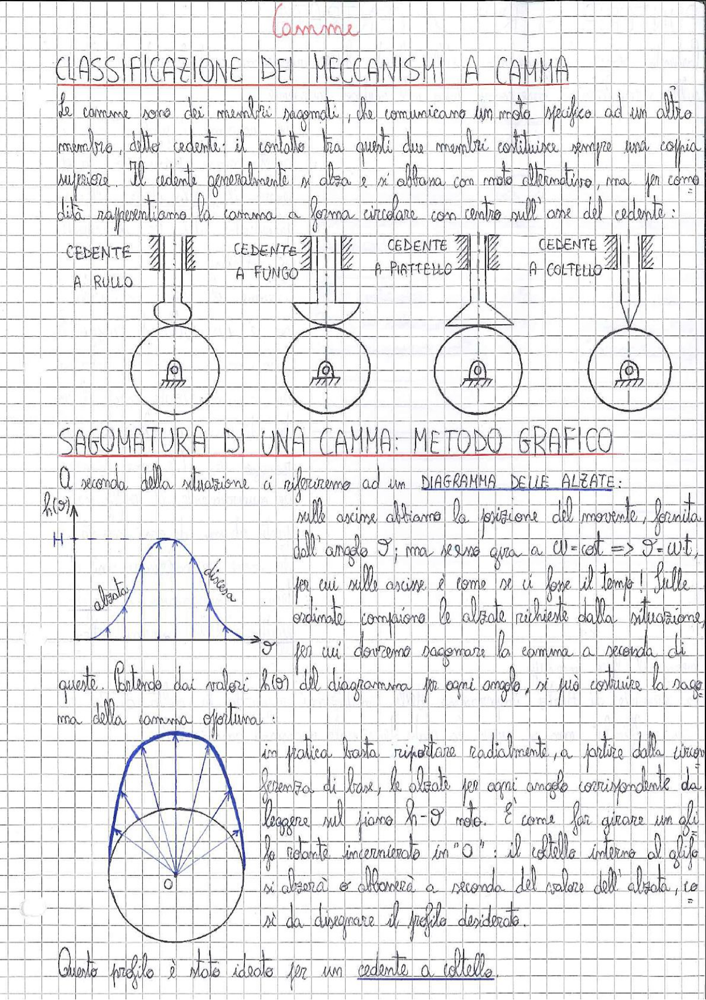

# Page 185 - Camme: Classificazione e Sagomatura

## Classificazione dei meccanismi a camma

Le camme sono dei membri sagomati, che comunicano un moto specifico ad un altro membro, detto cedente; il contatto tra questi due membri costituisce sempre una coppia superiore. Il cedente generalmente si alza e si abbassa con moto alternativo, ma per comodità rappresentiamo la camma a forma circolare con centro sull'asse del cedente:

> 
> Diagramma: Quattro tipologie di cedente per meccanismi a camma: cedente a rullo, cedente a fungo, cedente a piattello, cedente a coltello. Per ciascun tipo è mostrato il cedente in alto e la camma circolare sottostante.

---

## Sagomatura di una camma: metodo grafico

A seconda della situazione ci riferiremo ad un **DIAGRAMMA DELLE ALZATE**:

> 
> Diagramma: Diagramma delle alzate $h(\vartheta)$ con asse orizzontale $\vartheta$ e asse verticale $h(\vartheta)$. Mostra le fasi di alzata e discesa, con altezza massima $H$. Sotto, costruzione grafica della sagoma della camma mediante riporto radiale delle alzate sulla circonferenza di base.

Sulle ascisse abbiamo la posizione del movente, fornita dall'angolo $\vartheta$; ma senza gira a $\omega = \text{cost} \Rightarrow \vartheta = \omega \cdot t$, per cui sulle ascisse è come se ci fosse il tempo! Sulle ordinate compaiono le alzate richieste dalla situazione, per cui dovremo sagomare la camma a seconda di queste.

Partendo dai valori $h(\vartheta)$ del diagramma per ogni angolo, si può costruire la sagoma della camma effettiva:

In pratica basta riportare radialmente, a partire dalla circonferenza di base, le alzate per ogni angolo corrispondente da leggere sul piano $h$-$\vartheta$ noto. È come far girare un alo la ridante incernierato in "O": il coltello interno al glifo si alzerà o abbasserà a seconda del valore dell'alzata, così da disegnare il profilo desiderato.

Questo profilo è stato ideato per un **cedente a coltello**.
