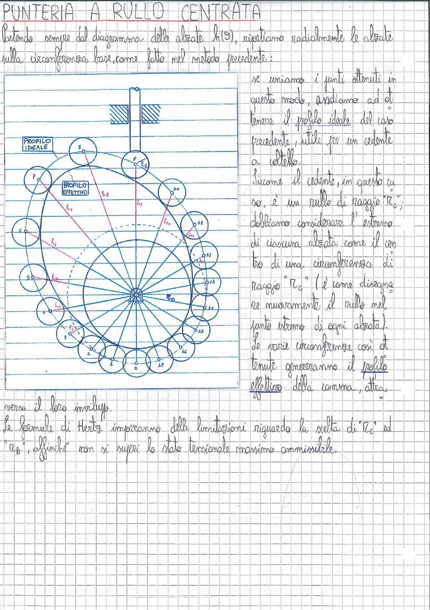

# Page 186 - Punteria a Rullo Centrata

## PUNTERIA A RULLO CENTRATA

Partendo sempre dal diagramma delle alzate $h(\vartheta)$, riportiamo radialmente le alzate sulla circonferenza base, come fatto nel metodo precedente:

> 
> Diagramma: Costruzione grafica del profilo effettivo di una camma con punteria a rullo centrata. Si mostra la circonferenza base con le alzate $h_1, h_2, \ldots, h_{17}$ riportate radialmente in corrispondenza delle posizioni angolari $1, 2, \ldots, 17$. Il profilo ideale è tracciato in rosso collegando gli estremi delle alzate. Attorno a ciascun estremo di alzata è disegnata una circonferenza di raggio $R_c$ (raggio del rullo). L'inviluppo di tali circonferenze genera il profilo effettivo della camma (indicato in azzurro tratteggiato). Al centro è indicato il raggio $R_0$ della circonferenza base. In alto è rappresentato schematicamente il cedente a rullo con la sua guida.

Se uniamo i punti ottenuti in questo modo, andiamo ad ottenere il **profilo ideale** del caso precedente, utile per un cedente a coltello.

Siccome il cedente, in questo caso, è un rullo di raggio $R_c$; dobbiamo considerare l'estremo di ciascuna alzata come il centro di una circonferenza di raggio "$R_c$" (è come disegnare muovamente il rullo nel punto estremo di ogni alzata).

Le varie circonferenze così ottenute genereranno il **profilo effettivo** della camma, attraverso il loro inviluppo.

Le formule di Hertz impongono delle limitazioni riguardo la scelta di "$R_c$" ed "$R_0$", affinché non si superi lo stato tensionale massimo ammissibile.
