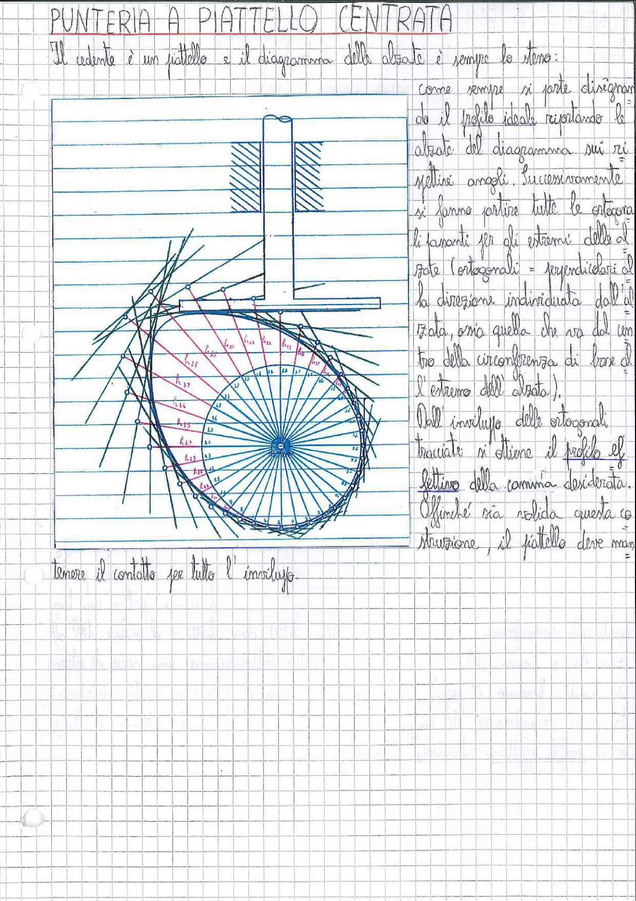

# Page 187 - Punteria a piattello centrata

## PUNTERIA A PIATTELLO CENTRATA

Il cedente è un piattello e il diagramma delle alzate è sempre lo stesso:

come sempre si parte disegnando il profilo ideale riportando le alzate del diagramma sui rispettivi angoli. Successivamente si fanno partire tutte le ortogonali tangenti per gli estremi delle alzate (ortogonali = perpendicolari alla direzione individuata dall'alzata, ossia quella che va dal centro della circonferenza di base all'estremo dell'alzata).

Dall'inviluppo delle ortogonali tracciate si ottiene il profilo effettivo della camma desiderata.

Affinché sia solida questa costruzione, il piattello deve mantenere il contatto per tutto l'inviluppo.

> 
> Diagramma: Costruzione grafica del profilo di una camma con punteria a piattello centrata. Si mostra la circonferenza di base con le alzate riportate sui rispettivi angoli ($h_{11}, h_{12}, h_{13}, h_{14}, h_{15}, h_{16}, h_{17}$, ecc.), le rette ortogonali (tangenti) tracciate dagli estremi delle alzate, e l'inviluppo risultante che definisce il profilo effettivo della camma. In alto è rappresentato il piattello con il suo stelo di guida.
