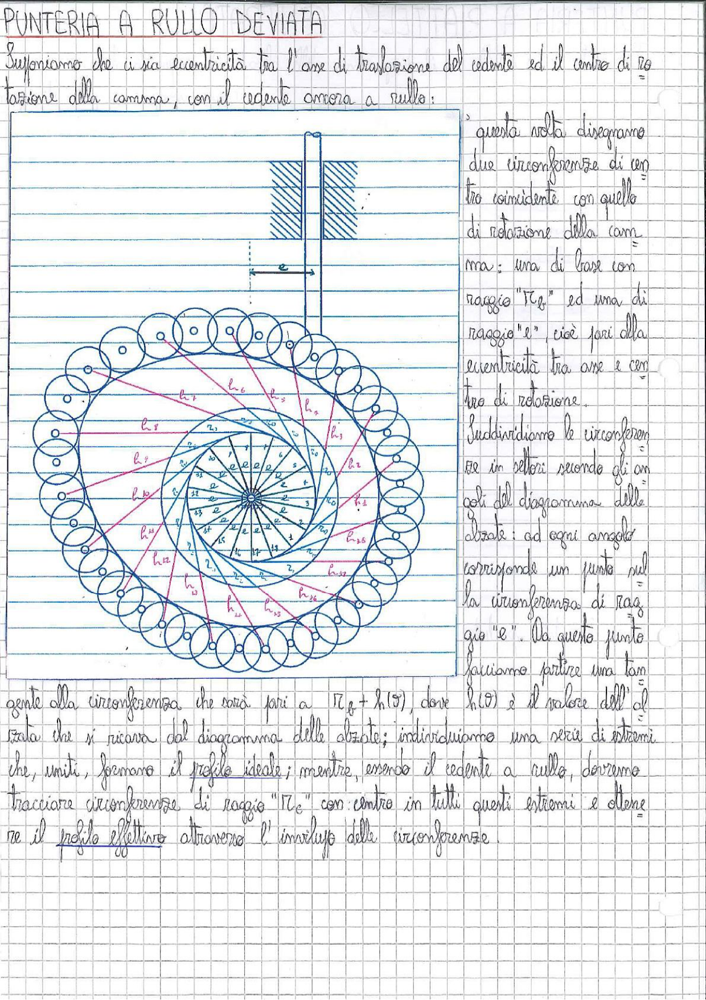

# Page 188 - Punteria a Rullo Deviata

## PUNTERIA A RULLO DEVIATA

Supponiamo che ci sia eccentricità tra l'asse di traslazione del cedente ed il centro di rotazione della camma, con il cedente ancora a rullo:

> 
> Diagramma: Costruzione grafica del profilo della camma con punteria a rullo deviata. Si mostrano due circonferenze concentriche (di raggio $R_b$ e raggio $e$), suddivise in settori angolari, con cerchi rappresentanti le posizioni successive del rullo lungo il profilo. Sono indicati i segmenti $h_1, h_2, \ldots, h_{26}$ corrispondenti alle alzate nei vari settori. In alto è rappresentato schematicamente il cedente a rullo con l'eccentricità $e$ rispetto al centro di rotazione.

Questa volta disegniamo due circonferenze di centro coincidente con quello di rotazione della camma: una di base con raggio "$R_b$" ed una di raggio "$e$" cioè pari alla eccentricità tra asse e centro di rotazione.

Suddividiamo le circonferenze in settori secondo gli angoli del diagramma delle alzate: ad ogni angolo corrisponde un punto sulla circonferenza di raggio "$e$". Da questo punto facciamo partire una tangente alla circonferenza che sarà pari a $R_b + h(\vartheta)$, dove $h(\vartheta)$ è il valore dell'alzata che si ricava dal diagramma delle alzate; individuiamo una serie di estremi che, uniti, formano il **profilo ideale**; mentre, essendo il cedente a rullo, dovremo tracciare circonferenze di raggio "$R_r$" con centro in tutti questi estremi e ottenere il **profilo effettivo** attraverso l'inviluppo delle circonferenze.
