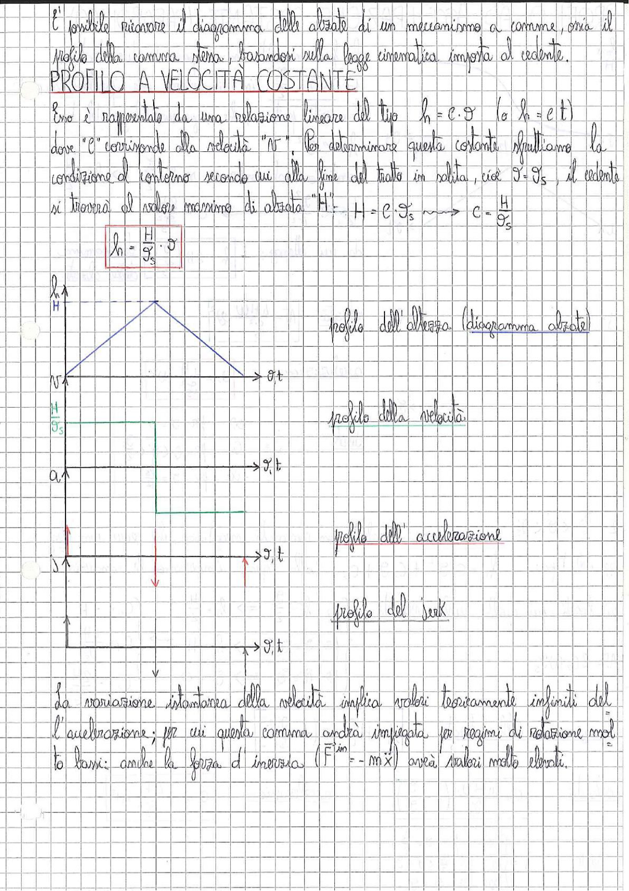

# Page 189 - Profilo a Velocità Costante (Camma)

È possibile ricavare il diagramma delle alzate di un meccanismo a camma, ossia il profilo della camma stessa, basandosi sulla legge cinematica imposta al cedente.

## PROFILO A VELOCITÀ COSTANTE

Esso è rappresentato da una relazione lineare del tipo $h = c \cdot \vartheta$ (o $h = c \cdot t$) dove "$c$" corrisponde alla velocità "$v$". Per determinare questa costante sfruttiamo la condizione al contorno secondo cui alla fine del tratto in salita, cioè $\vartheta = \vartheta_s$, il cedente si troverà al valore massimo di alzata "H": $H = c \cdot \vartheta_s \implies c = \dfrac{H}{\vartheta_s}$

$$\boxed{h = \frac{H}{\vartheta_s} \cdot \vartheta}$$

> 
> Diagramma: Serie di quattro grafici sovrapposti che mostrano i profili cinematici del cedente in funzione di $\vartheta$ (o $t$):
> 1. **Profilo dell'altezza (diagramma alzate)**: forma triangolare con alzata massima $H$, salita e discesa lineari
> 2. **Profilo della velocità**: forma rettangolare con valore costante $\frac{H}{\vartheta_s}$ durante la salita
> 3. **Profilo dell'accelerazione**: impulsi (delta di Dirac) positivi e negativi nei punti di discontinuità della velocità
> 4. **Profilo del jerk**: impulsi doppi (derivata dei delta) nei punti di variazione istantanea dell'accelerazione

---

La variazione istantanea della velocità implica valori teoricamente infiniti dell'accelerazione; per cui questa camma andrà impiegata per regimi di rotazione molto bassi: anche la forza d'inerzia ($F^{in} = -m\ddot{x}$) avrà valori molto elevati.
