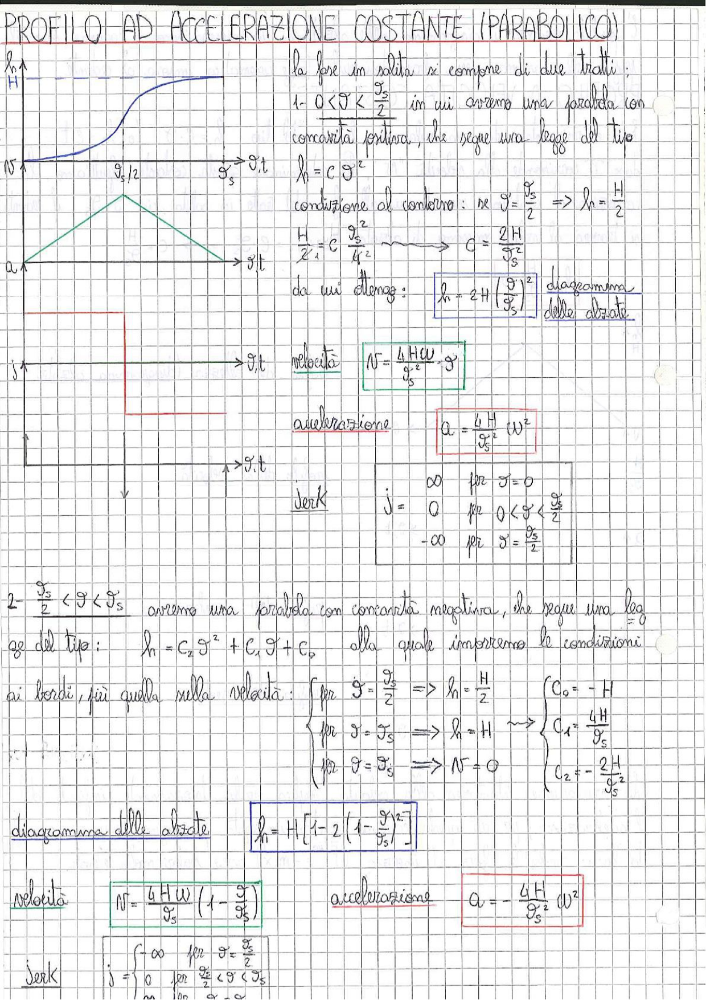

# Page 190 - Profilo ad Accelerazione Costante (Parabolico)

## PROFILO AD ACCELERAZIONE COSTANTE (PARABOLICO)

La fase in salita si compone di due tratti:

### 1° tratto: $0 < \vartheta < \frac{\vartheta_s}{2}$

In cui avremo una parabola con concavità positiva, che segue una legge del tipo:

$$h = C \vartheta^2$$

Condizione al contorno: per $\vartheta = \frac{\vartheta_s}{2} \Rightarrow h = \frac{H}{2}$

$$\frac{H}{2} = C \frac{\vartheta_s^2}{4} \quad \longrightarrow \quad C = \frac{2H}{\vartheta_s^2}$$

da cui si ottiene:

$$\boxed{h = 2H \left(\frac{\vartheta}{\vartheta_s}\right)^2} \quad \text{diagramma delle alzate}$$

**Velocità:**

$$\boxed{V = \frac{4H\omega}{\vartheta_s^2} \vartheta}$$

**Accelerazione:**

$$\boxed{a = \frac{4H}{\vartheta_s^2} \omega^2}$$

**Jerk:**

$$j = \begin{cases} \infty & \text{per } \vartheta = 0 \\ 0 & \text{per } 0 < \vartheta < \frac{\vartheta_s}{2} \\ -\infty & \text{per } \vartheta = \frac{\vartheta_s}{2} \end{cases}$$

> 
> Diagramma: Profilo parabolico ad accelerazione costante con diagrammi di alzata (h), velocità (V), accelerazione (a) e jerk (j) per il primo tratto della fase di salita

---

### 2° tratto: $\frac{\vartheta_s}{2} < \vartheta < \vartheta_s$

Avremo una parabola con concavità negativa, che segue una legge del tipo:

$$h = C_2 \vartheta^2 + C_1 \vartheta + C_0$$

alla quale imporremo le condizioni ai bordi, più quella sulla velocità:

$$\begin{cases} \text{per } \vartheta = \frac{\vartheta_s}{2} \Rightarrow h = \frac{H}{2} \\ \text{per } \vartheta = \vartheta_s \Rightarrow h = H \\ \text{per } \vartheta = \vartheta_s \Rightarrow V = 0 \end{cases} \quad \longrightarrow \quad \begin{cases} C_0 = -H \\ C_1 = \frac{4H}{\vartheta_s} \\ C_2 = -\frac{2H}{\vartheta_s^2} \end{cases}$$

**Diagramma delle alzate:**

$$\boxed{h = H \left[1 - 2\left(1 - \frac{\vartheta}{\vartheta_s}\right)^2\right]}$$

**Velocità:**

$$\boxed{V = \frac{4H\omega}{\vartheta_s}\left(1 - \frac{\vartheta}{\vartheta_s}\right)}$$

**Accelerazione:**

$$\boxed{a = -\frac{4H}{\vartheta_s^2} \omega^2}$$

**Jerk:**

$$j = \begin{cases} -\infty & \text{per } \vartheta = \frac{\vartheta_s}{2} \\ 0 & \text{per } \frac{\vartheta_s}{2} < \vartheta < \vartheta_s \end{cases}$$
