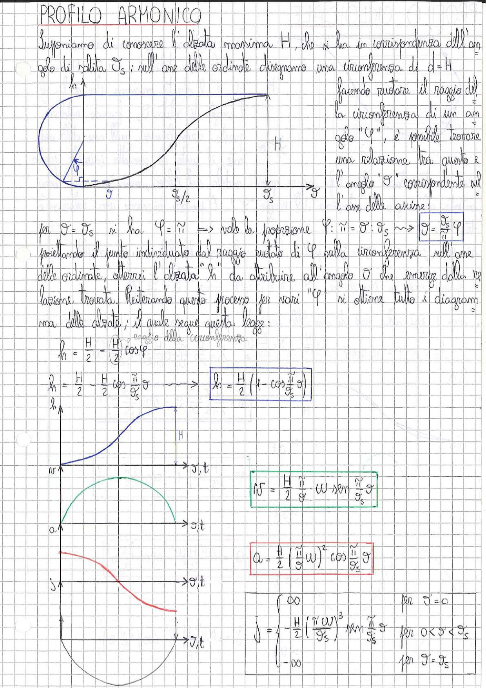

# Page 191 - Profilo Armonico

## PROFILO ARMONICO

Supponiamo di conoscere l'alzata massima $H$, che si ha in corrispondenza dell'angolo di salita $\vartheta_s$: sull'asse delle ordinate disegniamo una circonferenza di $d = H$.

> 
> Diagramma: Costruzione geometrica del profilo armonico con circonferenza di diametro H sull'asse delle ordinate, angolo φ sul raggio, e curva di alzata risultante fino a ϑ_s

Facendo ruotare il raggio della circonferenza di un angolo "$\varphi$", è possibile trovare una relazione tra questo e l'angolo "$\vartheta$" corrispondente sull'asse delle ascisse:

Per $\vartheta = \vartheta_s$ si ha $\varphi = \tilde{\pi}$ $\Rightarrow$ vale la proporzione $\varphi : \tilde{\pi} = \vartheta : \vartheta_s$ $\longrightarrow$ $\boxed{\vartheta = \frac{\vartheta_s}{\pi} \varphi}$

Proiettando il punto individuato dal raggio ruotato di $\varphi$ sulla circonferenza sull'asse delle ordinate, otterrei l'alzata "$h$" da attribuire all'angolo $\vartheta$ che emerge dalla relazione trovata. Reiterando questo processo per vari "$\varphi$" si ottiene tutto il diagramma delle alzate, il quale segue questa legge:

$$h = \frac{H}{2} - \underbrace{\frac{H}{2}}_{\text{raggio della circonferenza}} \cos\varphi$$

$$h = \frac{H}{2} - \frac{H}{2} \cos\frac{\tilde{\pi}}{\vartheta_s}\vartheta \longrightarrow \boxed{h = \frac{H}{2}\left(1 - \cos\frac{\tilde{\pi}}{\vartheta_s}\vartheta\right)}$$

---

## Velocità

> 
> Diagramma: Curva della velocità (v) in funzione di ϑ,t - forma sinusoidale con massimo H

$$\boxed{v = \frac{H}{2}\frac{\tilde{\pi}}{\vartheta_s} \cdot \omega \cdot \sin\frac{\tilde{\pi}}{\vartheta_s}\vartheta}$$

---

## Accelerazione

> 
> Diagramma: Curva dell'accelerazione (a) in funzione di ϑ,t - forma cosinusoidale (semicerchio verde)

$$\boxed{a = \frac{H}{2}\left(\frac{\tilde{\pi}}{\vartheta_s}\omega\right)^2 \cos\frac{\tilde{\pi}}{\vartheta_s}\vartheta}$$

---

## Jerk (Strappo)

> 
> Diagramma: Curva del jerk (j) in funzione di ϑ,t - forma sinusoidale negativa con discontinuità agli estremi (±∞)

$$j = -\frac{H}{2}\left(\frac{\tilde{\pi}\omega}{\vartheta_s}\right)^3 \sin\frac{\tilde{\pi}}{\vartheta_s}\vartheta$$

Con valori:

$$j = \begin{cases} \infty & \text{per } \vartheta = 0 \\ -\frac{H}{2}\left(\frac{\tilde{\pi}\omega}{\vartheta_s}\right)^3 \sin\frac{\tilde{\pi}}{\vartheta_s}\vartheta & \text{per } 0 < \vartheta < \vartheta_s \\ -\infty & \text{per } \vartheta = \vartheta_s \end{cases}$$
