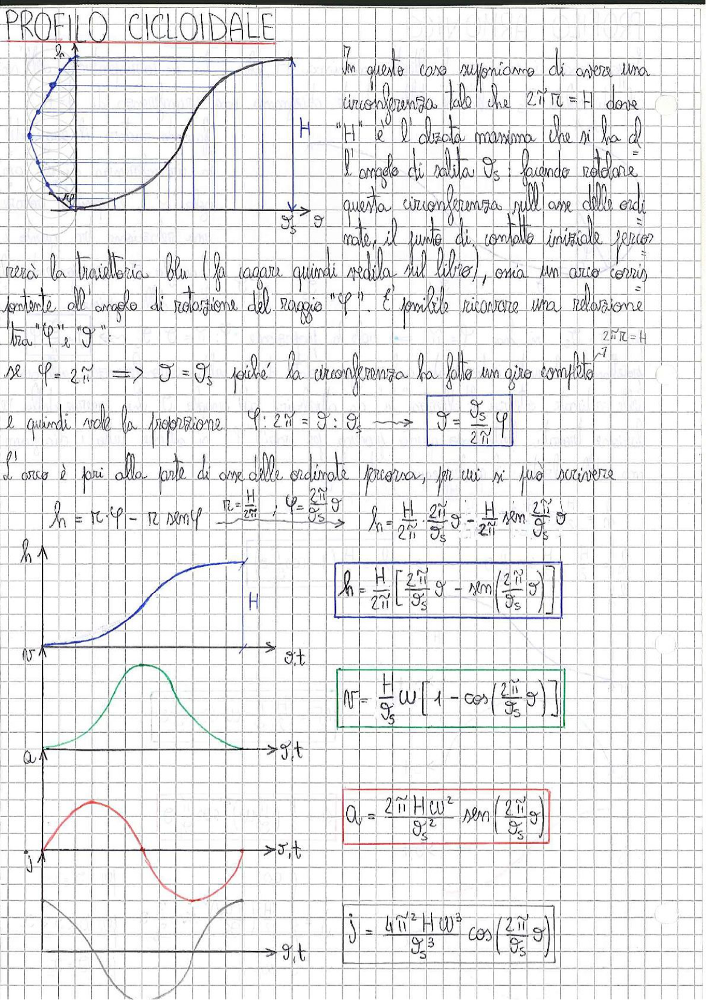

# Page 192 - Profilo Cicloidale

## PROFILO CICLOIDALE

In questo caso supponiamo di avere una circonferenza tale che $2\tilde{\pi} r = H$ dove "H" è l'alzata massima che si ha al l'angolo di salita $\vartheta_s$; facendo rotolare questa circonferenza sull'asse delle ordinate, il punto di contatto iniziale percorrerà la traiettoria blu (la curva quindi reale sul libro), ossia un arco corrispondente all'angolo di rotazione del raggio "$\varphi$". È possibile ricavare una relazione tra "$\varphi$", "$\vartheta$":

$$2\tilde{\pi} r = H$$

se $\varphi = 2\tilde{\pi} \implies \vartheta = \vartheta_s$ poiché la circonferenza ha fatto un giro completo

e quindi vale la proporzione $\varphi : 2\tilde{\pi} = \vartheta : \vartheta_s \longrightarrow$

$$\boxed{\vartheta = \frac{\vartheta_s}{2\tilde{\pi}} \varphi}$$

L'arco è pari alla parte di asse delle ordinate percorsa, per cui si può scrivere:

$$h = r \cdot \varphi - r \sin\varphi \quad \xrightarrow{r = \frac{H}{2\tilde{\pi}}, \quad \varphi = \frac{2\tilde{\pi}}{\vartheta_s}\vartheta} \quad h = \frac{H}{2\tilde{\pi}} \cdot \frac{2\tilde{\pi}}{\vartheta_s} \vartheta - \frac{H}{2\tilde{\pi}} \sin\frac{2\tilde{\pi}}{\vartheta_s} \vartheta$$

$$\boxed{h = \frac{H}{2\tilde{\pi}} \left[ \frac{2\tilde{\pi}}{\vartheta_s} \vartheta - \sin\left(\frac{2\tilde{\pi}}{\vartheta_s} \vartheta\right) \right]}$$

---

### Velocità

$$\boxed{v = \frac{H}{\vartheta_s} \omega \left[ 1 - \cos\left(\frac{2\tilde{\pi}}{\vartheta_s} \vartheta\right) \right]}$$

---

### Accelerazione

$$\boxed{a_v = \frac{2\tilde{\pi} H \omega^2}{\vartheta_s^2} \sin\left(\frac{2\tilde{\pi}}{\vartheta_s} \vartheta\right)}$$

---

### Jerk

$$\boxed{j = \frac{4\tilde{\pi}^2 H \omega^3}{\vartheta_s^3} \cos\left(\frac{2\tilde{\pi}}{\vartheta_s} \vartheta\right)}$$

---

> 
> Diagramma: In alto a sinistra è rappresentata una circonferenza di raggio r che rotola sull'asse delle ordinate, generando il profilo cicloidale (curva blu). A destra si trova il diagramma di alzata h in funzione di ϑ (curva ad S). Sotto sono riportati i diagrammi della velocità v (curva a campana, verde), dell'accelerazione a (curva sinusoidale con un picco positivo, in rosso) e del jerk j (curva cosinusoidale) tutti in funzione di ϑ,t.
