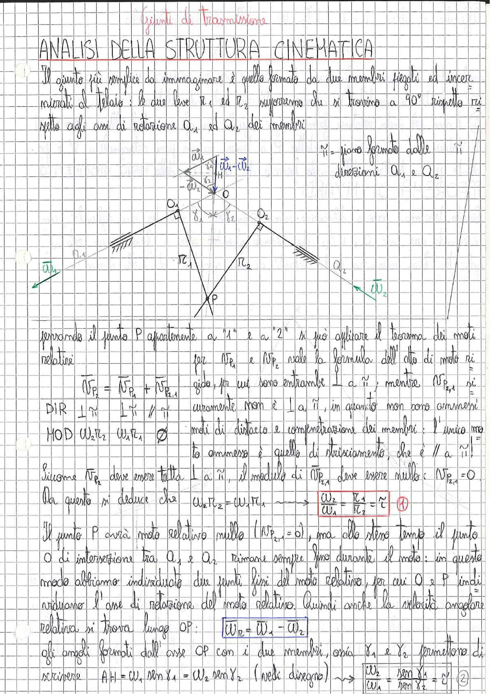

# Page 193 - Giunti di Trasmissione: Analisi della Struttura Cinematica

## ANALISI DELLA STRUTTURA CINEMATICA

Il giunto più semplice da immaginare è quello formato da due membri rigidi ed incernierati al "telaio": le due leve $r_1$ ed $r_2$ supporremo che si trovino a 90° rispetto rispetto agli assi di rotazione $a_1$ ed $a_2$ dei membri.

$\hat{n}$ = piano formato dalle direzioni $a_1$ e $a_2$

> 
> Diagramma: Schema cinematico di un giunto di trasmissione con due leve $r_1$ e $r_2$ incernierate al telaio, con assi di rotazione $a_1$ e $a_2$, punto O di intersezione degli assi, punto P di intersezione delle leve, vettori velocità angolari $\vec{\omega}_1$ e $\vec{\omega}_2$, e angoli $\gamma_1$ e $\gamma_2$ formati dall'asse OP con i due membri.

Essendo il punto P appartenente a "1" e a "2" si può applicare il teorema dei moti relativi.

Per $\vec{v}_{P_1}$ e $\vec{v}_{P_2}$ vale la formula dell'atto di moto rigido, per cui sono entrambe $\perp$ a $\hat{n}$; mentre $\vec{v}_{P_{2,1}}$ si-

$$\vec{v}_{P_2} = \vec{v}_{P_1} + \vec{v}_{P_{2,1}}$$

| | DIR | $\perp \hat{n}$ | $\perp \hat{n}$ | $// \hat{n}$ |
|---|---|---|---|---|
| | MOD | $\omega_2 r_2$ | $\omega_1 r_1$ | $\varnothing$ |

curamente non è $\perp$ a $\hat{n}$, in quanto non sono ammessi moti di distacco e compenetrazione dei membri: l'unico moto ammesso è quello di strisciamento, che è $//$ a $\hat{n}$!

Siccome $\vec{v}_{P_2}$ deve essere tutta $\perp$ a $\hat{n}$, il modulo di $\vec{v}_{P_{2,1}}$ deve essere nullo: $\vec{v}_{P_{2,1}} = 0$.

Da questo si deduce che:

$$\omega_2 r_2 = \omega_1 r_1 \longrightarrow \boxed{\frac{\omega_2}{\omega_1} = \frac{r_1}{r_2} = \tau} \quad \textcircled{1}$$

Il punto P avrà moto relativo nullo ($\vec{v}_{P_{2,1}} = 0$), ma allo stesso tempo il punto O di intersezione tra $a_1$ e $a_2$ rimane sempre fermo durante il moto: in questo modo abbiamo individuato due punti fissi del moto relativo, per cui O e P individuano l'asse di rotazione del moto relativo. Quindi anche la velocità angolare relativa si trova lungo OP:

$$\boxed{\vec{\omega}_R = \vec{\omega}_1 - \vec{\omega}_2}$$

Gli angoli formati dall'asse OP con i due membri, ossia $\gamma_1$ e $\gamma_2$, permettono di scrivere:

$$AH = \omega_1 \sin \gamma_1 = \omega_2 \sin \gamma_2 \quad (\text{vedi disegno}) \longrightarrow \boxed{\frac{\omega_2}{\omega_1} = \frac{\sin \gamma_1}{\sin \gamma_2} = \tau} \quad \textcircled{2}$$
