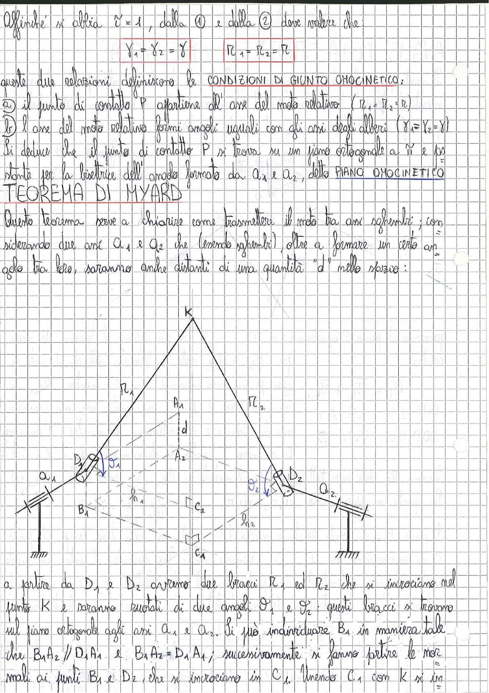

# Page 194 - Giunto Omocinetico e Teorema di Myard

Affinché si abbia $\tau = 1$, dalla ① e dalla ② deve valere che:

$$\boxed{\gamma_1 = \gamma_2 = \gamma} \qquad \boxed{R_1 = R_2 = R}$$

Queste due relazioni definiscono le **CONDIZIONI DI GIUNTO OMOCINETICO**:

a) il punto di contatto P appartiene all'asse del moto relativo ($R_1 = R_2 = R$)

b) l'asse del moto relativo formi angoli uguali con gli assi degli alberi ($\gamma_1 = \gamma_2 = \gamma$)

Si deduce che il punto di contatto P si trova su un piano ortogonale a $\hat{n}$ e passante per la bisettrice dell'angolo formato da $A_1$ e $A_2$, detto **PIANO OMOCINETICO**.

## TEOREMA DI MYARD

Questo teorema serve a chiarire come trasmettere il moto tra assi sghembi; considerando due assi $A_1$ e $A_2$ che (essendo sghembi), oltre a formare un certo angolo tra loro, saranno anche distanti di una quantità "$d$" nello spazio:

> 
> Diagramma: Schema del meccanismo di Myard con due alberi sghembi $A_1$ e $A_2$ distanti $d$, collegati da due bracci $R_1$ e $R_2$ che si incrociano nel punto K, con punti $D_1$, $D_2$, $B_1$, $C_2$, $C_1$ e normali ai punti $B_1$ e $D_2$ che si incrociano in $C_1$. Angoli $\theta_1$ e $\theta_2$ indicati sui rispettivi assi.

A partire da $D_1$ e $D_2$ avremo due bracci $R_1$ ed $R_2$ che si incrociano nel punto K e saranno ruotati di due angoli $\theta_1$ e $\theta_2$; questi bracci si trovano sul piano ortogonale agli assi $A_1$ e $A_2$. Si può individuare $B_1$ in maniera tale che $B_1 A_2 \parallel D_1 A_1$ e $B_1 A_2 = D_1 A_1$; successivamente si fanno partire le normali ai punti $B_1$ e $D_2$ che si incrociano in $C_1$. Unendo $C_1$ con K si in-
