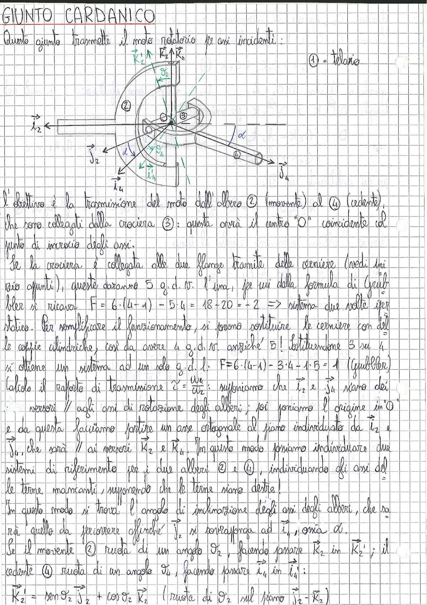

# Page 196 - Giunto Cardanico

## GIUNTO CARDANICO

Questo giunto trasmette il moto rotatorio tra assi incidenti:

> 
> Diagramma: Schema di un giunto cardanico con albero movente ②, crociera ③, albero cedente ④ e telaio ①. Sono indicati i versori $\vec{i}_2$, $\vec{j}_2$, $\vec{K}_2$, $\vec{i}_4$, $\vec{j}_4$, $\vec{K}_4$, gli angoli $\vartheta_2$, $\vartheta_4$ e l'angolo di inclinazione $\alpha$ tra gli assi.

- ① = telaio
- ② = albero movente
- ③ = crociera
- ④ = albero cedente

L'obiettivo è la trasmissione del moto dall'albero ② (movente) al ④ (cedente), che sono collegati dalla crociera ③: questa avrà il centro "O" coincidente col punto di incrocio degli assi.

Se la crociera è collegata alle due flange tramite delle cerniere (vedi uni vio giunti), queste daranno 5 g.d.v. l'una, per cui dalla formula di Grübler si ricava:

$$F = 6 \cdot (4-1) - 5 \cdot 4 = 18 - 20 = -2 \implies \text{sistema due volte iperstatico}$$

Per semplificare il funzionamento, si possono sostituire le cerniere con delle coppie cilindriche, così da avere 4 g.d.v. anziché 5! Sostituendone 3 su 4, si ottiene un sistema ad un solo g.d.l.:

$$\boxed{F = 6 \cdot (4-1) - 3 \cdot 4 - 1 \cdot 5 = 1 \quad \text{(Grübler)}}$$

Calcolo il rapporto di trasmissione $\tau = \frac{\omega_4}{\omega_2}$: supponiamo che $\vec{i}_2$ e $\vec{j}_4$ siano dei versori $\parallel$ agli assi di rotazione degli alberi; poi poniamo l'origine in "O" e da questa facciamo partire un asse ortogonale al piano individuato da $\vec{i}_2$ e $\vec{j}_4$, che sarà $\parallel$ ai versori $\vec{K}_2$ e $\vec{K}_4$. In questo modo possiamo individuare due sistemi di riferimento per i due alberi ② e ④, individuando gli assi delle terne mancanti, supponendo che le terne siano destre!

In questo modo si trova l'angolo di inclinazione degli assi degli alberi, che sarà quello da percorrere affinché $\vec{i}_2$ si sovrapponga ad $\vec{i}_4$, ossia $\alpha$.

Se il movente ② ruota di un angolo $\vartheta_2$, facendo passare $\vec{K}_2$ in $\vec{K}_2'$; il cedente ④ ruota di un angolo $\vartheta_4$, facendo passare $\vec{i}_4$ in $\vec{i}_4'$:

$$\vec{K}_2' = \sin\vartheta_2 \, \vec{j}_2 + \cos\vartheta_2 \, \vec{K}_2 \quad \text{(ruota di } \vartheta_2 \text{ sul piano } \vec{j}_2 - \vec{K}_2\text{)}$$
