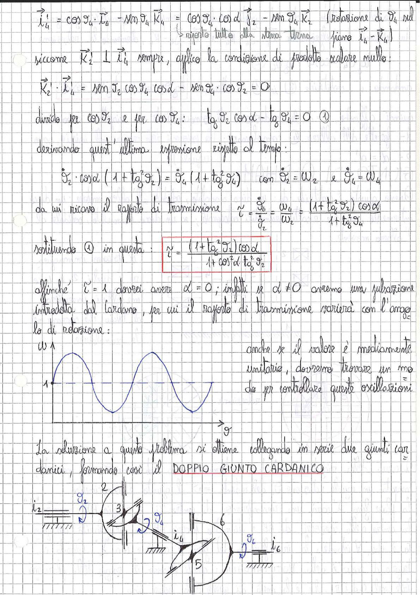

# Page 197 - Giunto Cardanico: Rapporto di Trasmissione e Doppio Giunto Cardanico

$$\vec{i}'_4 = \cos \vartheta_4 \cdot \vec{i}_4 - \sin \vartheta_4 \, \vec{k}_4 = \cos \vartheta_4 \cos \alpha \, \vec{j}_2 - \sin \vartheta_4 \, \vec{k}_2 \quad \text{(rotazione di } \vartheta_4 \text{ sul piano } \vec{i}_4 - \vec{k}_4\text{)}$$

> riporto tutto alla stessa terna

Siccome $\vec{K}'_2 \perp \vec{i}'_4$ sempre, applico la condizione di prodotto scalare nullo:

$$\vec{K}'_2 \cdot \vec{i}'_4 = \sin \vartheta_2 \cos \vartheta_4 \cos \alpha - \sin \vartheta_4 \cdot \cos \vartheta_2 = 0$$

Divido per $\cos \vartheta_2$ e per $\cos \vartheta_4$:

$$\tan \vartheta_2 \cos \alpha - \tan \vartheta_4 = 0 \quad \text{①}$$

Derivando quest'ultima espressione rispetto al tempo:

$$\dot{\vartheta}_2 \cdot \cos \alpha \left(1 + \tan^2 \vartheta_2\right) = \dot{\vartheta}_4 \left(1 + \tan^2 \vartheta_4\right) \quad \text{con } \dot{\vartheta}_2 = \omega_2 \text{ e } \dot{\vartheta}_4 = \omega_4$$

da cui ricavo il rapporto di trasmissione:

$$\tau = \frac{\dot{\vartheta}_4}{\dot{\vartheta}_2} = \frac{\omega_4}{\omega_2} = \frac{(1 + \tan^2 \vartheta_2) \cos \alpha}{1 + \tan^2 \vartheta_4}$$

Sostituendo ① in questa:

$$\boxed{\tau = \frac{(1 + \tan^2 \vartheta_2) \cos \alpha}{1 + \cos^2 \alpha \, \tan^2 \vartheta_2}}$$

Affinché $\tau = 1$ dovrei avere $\alpha = 0$; infatti se $\alpha \neq 0$ avremo una pulsazione introdotta dal cardano, per cui il rapporto di trasmissione varierà con l'angolo di rotazione:

> 
> Diagramma: Grafico di ω in funzione di ϑ che mostra l'oscillazione del rapporto di trasmissione attorno al valore unitario, con pulsazioni periodiche dovute all'angolo α ≠ 0

Anche se il valore è mediamente unitario, dovremo trovare un modo per controllare queste oscillazioni.

---

## Doppio Giunto Cardanico

La soluzione a questo problema si ottiene collegando in serie due giunti cardanici, formando così il **DOPPIO GIUNTO CARDANICO**.

> 
> Diagramma: Schema cinematico del doppio giunto cardanico con due giunti in serie. Si identificano gli alberi con le rispettive coordinate: albero di ingresso con $i_2$ e $\vartheta_2$, elemento intermedio (membro 3) con $\vartheta_4$ e $i_4$, e albero di uscita con $\vartheta_6$ e $i_6$. I membri sono numerati 2, 3, 4, 5, 6.
