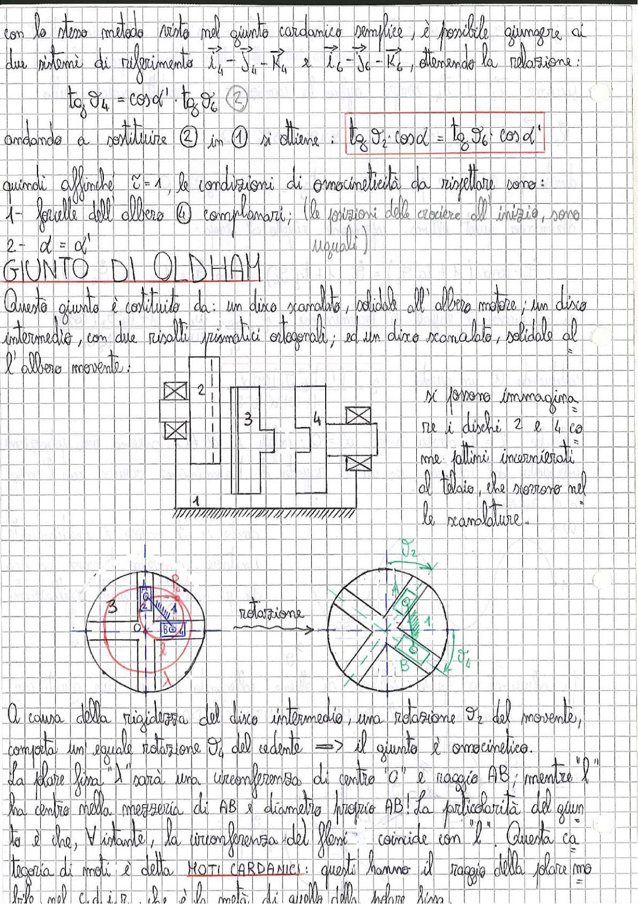

# Page 198 - Giunto di Oldham / Condizioni di omocineticità

Con lo stesso metodo visto nel giunto cardanico semplice, è possibile giungere ai due sistemi di riferimento $\vec{i}_4 - \vec{j}_4 - \vec{k}_4$ e $\vec{i}_6 - \vec{j}_6 - \vec{k}_6$, ottenendo la relazione:

$$\tan \vartheta_4 = \cos \alpha' \cdot \tan \vartheta_6 \quad (2)$$

andando a sostituire (2) in (1) si ottiene:

$$\boxed{\tan \vartheta_2 \cdot \cos \alpha = \tan \vartheta_6 \cdot \cos \alpha'}$$

quindi affinché $\tilde{\tau} = 1$, le condizioni di omocineticità da rispettare sono:

1. forcelle dell'albero (4) complanari; (le posizioni delle crociere all'inizio, sono uguali)
2. $\alpha = \alpha'$

---

## GIUNTO DI OLDHAM

Questo giunto è costituito da: un disco scanalato, solidale all'albero motore; un disco intermedio, con due risalti prismatici ortogonali; ed un disco scanalato, solidale all'albero movente:

> 
> Diagramma: Schema costruttivo del giunto di Oldham con vista in sezione. Si vedono i componenti numerati: 1 (telaio), 2 (disco scanalato motore), 3 (disco intermedio con risalti prismatici ortogonali), 4 (disco scanalato movente). I dischi 2 e 4 sono rappresentati come pattini incernierati al telaio che scorrono nelle scanalature.

Si possono immaginare i dischi 2 e 4 come pattini incernierati al telaio, che scorrono nelle scanalature.

> 
> Diagramma: Vista frontale del giunto di Oldham prima e dopo la rotazione. A sinistra: vista con i punti A, B, O e il disco 3 (cerchio con settori). A destra: dopo la rotazione, si vedono gli angoli $\vartheta_2$ e $\vartheta_4$ e i punti A, B, C con la circonferenza dei flessi.

A causa della rigidezza del disco intermedio, una rotazione $\vartheta_2$ del movente, comporta un'eguale rotazione $\vartheta_4$ del cedente $\Rightarrow$ il giunto è omocinetico.

Laolare fissa "l" sarà una circonferenza di centro "O" e raggio AB; mentre "l" ha centro nella mezzeria di AB e diametro proprio AB! La particolarità del giunto è che, $\forall$ istante, la circonferenza dei flessi coincide con "l". Questa categoria di moti è detta **MOTI CARDANICI**: questi hanno il raggio della polare mobile nel C.d.I.R. che è la metà di quello della polare fissa.
