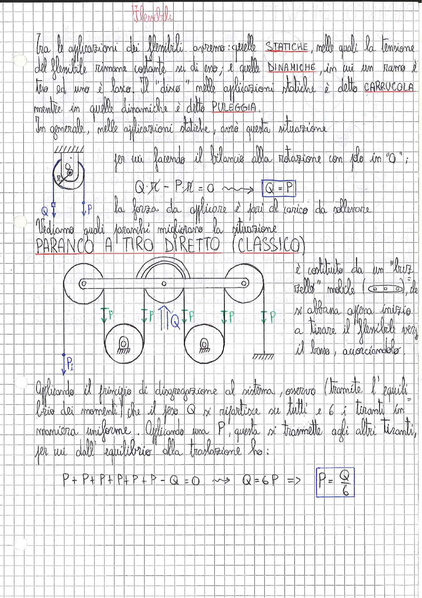

# Page 199 - Flessibili

## Applicazioni dei flessibili

Tra le applicazioni dei flessibili avremo: quelle **STATICHE**, nelle quali la tensione del flessibile rimane costante su di esso; e quelle **DINAMICHE**, in cui un ramo è teso ed uno è lasco. Il "disco" nelle applicazioni statiche è detto **CARRUCOLA** mentre in quelle dinamiche è detto **PULEGGIA**.

In generale, nelle applicazioni statiche, avrò questa situazione:

> 
> Diagramma: Carrucola fissata a parete con carico Q e forza P applicata ai due rami del flessibile

per cui facendo il bilancio alla rotazione con polo in "O":

$$Q \cdot r - P \cdot r = 0 \quad \longrightarrow \quad \boxed{Q = P}$$

La forza da applicare è pari al carico da sollevare.

Vediamo quali paranchi migliorano la situazione.

## PARANCO A TIRO DIRETTO (CLASSICO)

> 
> Diagramma: Schema di paranco a tiro diretto con tre carrucole fisse in alto e tre carrucole mobili in basso, collegate da un unico flessibile con 6 tiranti, carico Q applicato al blocco mobile e forza P applicata all'estremità del flessibile

È costituito da un "bozzello" mobile (⊙⊙⊙), che si abbassa appena inizio a tirare il flessibile verso il basso, accorciandolo.

Applicando il principio di disgregazione al sistema, osservo (tramite l'equilibrio dei momenti) che il peso $Q$ si ripartisce su tutti e 6 i tiranti in maniera uniforme. Applicando una $P$, questa si trasmette agli altri tiranti, per cui dall'equilibrio alla traslazione ho:

$$P + P + P + P + P + P - Q = 0 \quad \longrightarrow \quad Q = 6P \quad \Rightarrow \quad \boxed{P = \frac{Q}{6}}$$
