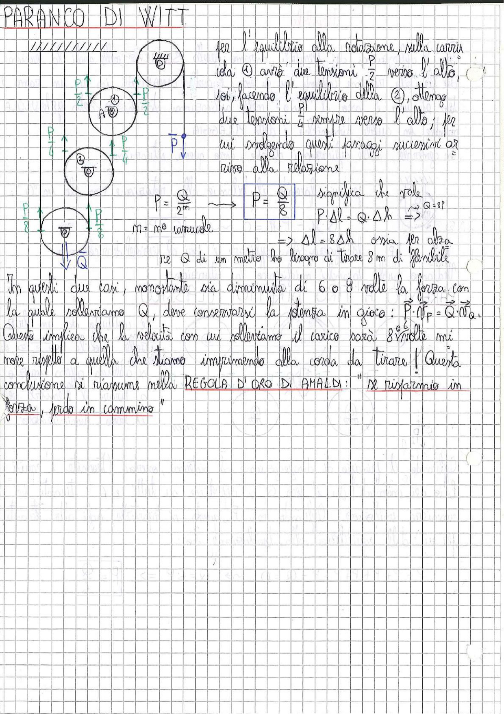

# Page 200 - Paranco di Witt

## PARANCO DI WITT

> 
> Diagramma: Schema del paranco di Witt con sistema di carrucole multiple (fisse e mobili) collegate da fune, con carico Q applicato in basso e forza P applicata all'estremità libera della fune. Sono indicate le tensioni nei vari tratti di fune ($P$, $\frac{P}{2}$, $\frac{P}{4}$, $\frac{P}{6}$, $\frac{P}{8}$) e le carrucole numerate ①, ②.

Per l'equilibrio alla rotazione, sulla carrucola ① avrò due tensioni $\frac{P}{2}$ verso l'alto; poi, facendo l'equilibrio della ②, ottengo due tensioni $\frac{P}{4}$ sempre verso l'alto; per cui svolgendo questi passaggi successivi si arriva alla relazione:

$$P = \frac{Q}{2^m} \longrightarrow \boxed{P = \frac{Q}{8}}$$

significa che vale:

$$P \cdot \Delta l = Q \cdot \Delta h \implies$$

$$\implies \Delta l = 8 \, \Delta h$$

$m$ = n° carrucole

ossia per alzare Q di un metro ho bisogno di tirare 8 m di flessibile.

---

In questi due casi, nonostante sia diminuita di 6 o 8 volte la forza con la quale solleviamo Q, deve conservarsi la potenza in gioco: $P \cdot \vec{V}_P = Q \cdot \vec{V}_Q$.

Questo implica che la velocità con cui solleviamo il carico sarà 8 volte minore rispetto a quella che stiamo imprimendo alla corda da tirare! Questa conclusione si riassume nella **REGOLA D'ORO DI AMALDI**: *"se risparmio in forza, perdo in cammino"*
