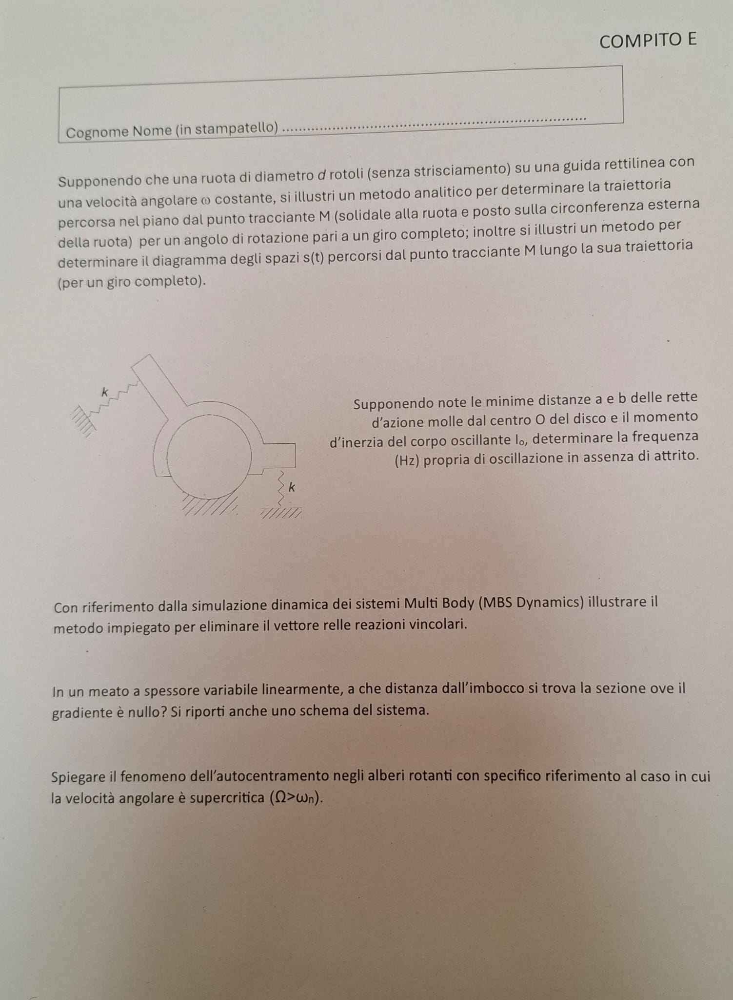

# Compito E

1. Supponendo che una ruota di diametro $d$ rotoli (senza strisciamento) su una guida rettilinea con una velocità angolare $\omega$ costante, si illustri un metodo analitico per determinare la traiettoria percorsa nel piano dal punto tracciante M (solidale alla ruota e posto sulla circonferenza esterna della ruota) per un angolo di rotazione pari a un giro completo; inoltre si illustri un metodo per determinare il diagramma degli spazi $s(t)$ percorsi dal punto tracciante M lungo la sua traiettoria (per un giro completo).

2. Supponendo note le minime distanze $a$ e $b$ delle rette d'azione molle dal centro O del disco e il momento d'inerzia del corpo oscillante $I_o$, determinare la frequenza (Hz) propria di oscillazione in assenza di attrito.

   

3. Con riferimento dalla simulazione dinamica dei sistemi Multi Body (MBS Dynamics) illustrare il metodo impiegato per eliminare il vettore delle reazioni vincolari.

4. In un meato a spessore variabile linearmente, a che distanza dall'imbocco si trova la sezione ove il gradiente è nullo? Si riporti anche uno schema del sistema.

5. Spiegare il fenomeno dell'autocentramento negli alberi rotanti con specifico riferimento al caso in cui la velocità angolare è supercritica ($\Omega > \omega_n$).
